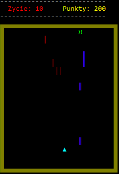
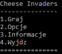
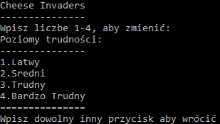

# -Cheese Invaders-
 
### Opis
Gra typu Space Invaders. 
Gracz steruję statkiem, jego zadaniem jest zdobywanie punktów poprzez eliminowanie przeciwników. Statek może zostać zniszczony po kontakcie z pociskiem na planszy(gracz może zostać zniszczony w wyniku kontaktu ze swoim pociskiem)

### Sterowanie:: 
ruch - strzałki 
strzelanie - spacja 

### Menu
 
Graj - włącza gre 
Opcje - umozliwia wybranie 4 poziomow trudności 
Informacje - zawierają informacje o autorze 
Wyjdz - wylacza program 

### Opcje
 
Poziomy trudności różnią się szybkością rozgrywki oraz ilością żyć gracza.

